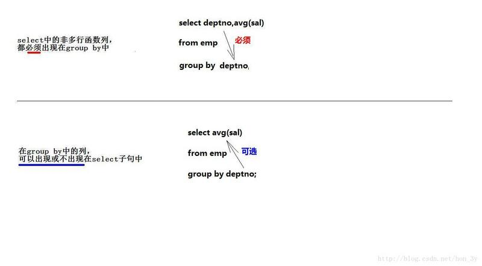
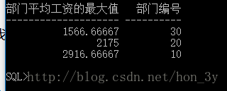

# DQL

## 0 查询的一般形式

```sql
SELECT [ALL|DISTINCT] <列名1 [新列名]>[,<列名2>,<列名3>]
FROM <表名>
WHERE <条件表达式>
GROUP BY <列名> HAVING <组条件表达式>
ORDER BY <列名> [ASC|DESC]
```

## 1 单表查询

### 1.1 列

```sql
SELECT SNO,SNAME,AGE
FROM T_STUDENT;
```

```sql
SELECT *
FROM T_COURSE;
```

```sql
--查询出生日期。
--也就是说，属性名可以简单计算。
SELECT 2018-AGE
FROM T_STUDENT;
--修改列名
SELECT 2018-AGE 出生年份,SEX 性别,SNAME 学生姓名
FROM T_STUDENT;
```

### 1.2 行

```sql
SELECT DISTINCT DEPT
FROM T_STUDENT;
```

### 1.3 使用了查询条件



```sql
SELECT SNAME
FROM T_STUDENT
WHERE DEPT='数学系';
```



```sql
SELECT SNAME,AGE
FROM T_STUDENT
WHERE AGE BETWEEN 16 AND 20;
```



```sql
SELECT SNAME,SEX
FROM T_STUDENT
WHERE DEPT IN ('计算机系','日语系','管理系');
```



```sql
SELECT SNAME,AGE,DEPT
FROM T_STUDENT
WHERE SNAME LIKE '张%';

SELECT SNAME,AGE
FROM STUDENT
WHERE SNAME LIKE '_七%';

SELECT *
FROM T_COURSE
WHERE CNAME LIKE 'jsp\_%g_' ESCAPE'\';
```



```sql
SELECT SNO,CNO
FROM T_STUDENT_COURSE
WHERE GRADE IS NULL;
```



```sql
SELECT SNAME,AGE
FROM T_STUDENT
WHERE DEPT='日语系'
AND SEX='女';

SELECT SNAME
FROM T_STUDENT
WHERE DEPT='管理系'
OR AGE<
```



### 1.4 排序

```sql
SELECT SNO,GRADE
FROM T_STUDENT_COURSE
WHERE CNO='c3'
ORDER BY GRADE DESC;

SELECT *
FROM T_STUDENT
ORDER BY AGE ASC,SNO DESC;--此处指：年龄升序的同时，学号降序。并且先排年龄，再排年龄相同的人的学号。
```

### 1.5 聚组函数

```sql
--查询学生表的总人数
SELECT COUNT(*)
FROM T_STUDENT;
```

上面的语句结果为：

| COUNT\(\*\) |
| :--- |
| 10 |

## 2 分组查询

1. 先从表里取出要分组的属性
2. 然后建立出来分组的新表

```sql
SELECT CNO,COUNT(SNO)
FROM T_STUENDT_COURSE
GROUP BY CNO;
```

> 参考：[https://segmentfault.com/a/1190000013541049](https://segmentfault.com/a/1190000013541049)
>
> ### GROUP BY 细节 <a id="item-8"></a>
>
> group by 子句的细节：
>
> * **1）在select子句中出现的非多行函数的所有列，【必须】出现在group by子句中**
> * **2）在group by子句中出现的所有列，【可出现可不现】在select子句中**
>
> 
>
> 举例子：**下面这段代码是错误的！！！**
>
> ```sql
>
>     select max(avg(sal)) "部门平均工资的最大值",deptno "部门编号"
>     from emp
>     group by deptno;
> ```
>
> 为啥是错误的呢？？？分组中我们已经有了deptno字段了，而我们select 后面跟着也就是多行函数和该字段而已，为啥就错了呢？？？？？**我们如果在分组查询的时候，使用了多行函数嵌套的话，那么我们select字段后面只能跟随着它这么一个列，而不能再多了。max\(avg\(sal\)\) 相当于又分组了一次**
>
> 当然了，如果我们仅仅是求出每个部门的平均工资，也就是下面这段代码，是完全没有问题的：
>
> ```sql
>     select avg(sal) "部门平均工资的最大值",deptno "部门编号"
>     from emp
>     group by deptno;
> ```
>
> 

## 3 链接查询

